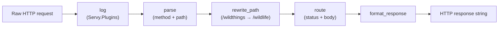
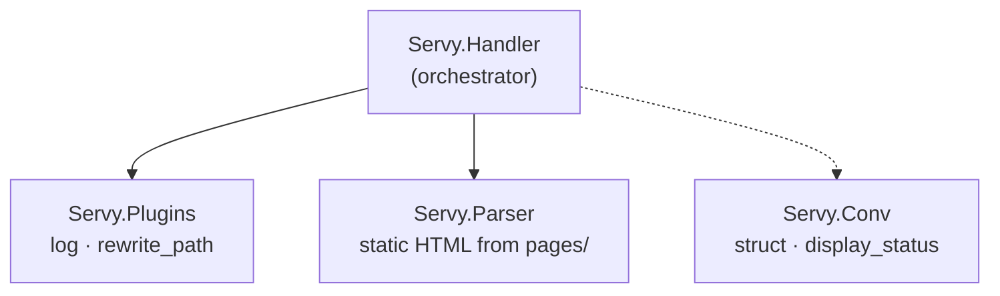
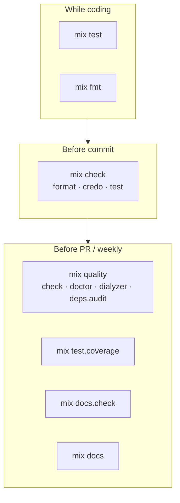

# Servy

A minimal HTTP request handler built while working through
[Pragmatic Studio's Elixir course](https://pragmaticstudio.com/elixir).
Servy parses raw HTTP/1.1 requests, routes them to handlers, and formats
responses — without a web framework.

## How it works

A request flows through a pipeline of functions, each transforming a **conv**
(conversation) struct (`%Servy.Conv{}`):

```elixir
%Servy.Conv{method: "GET", path: "/wildlife", resp_body: "", status: nil}
```



### Module relationships



## Modules

| Module | Responsibility |
| --- | --- |
| `Servy.Handler` | Orchestrates the pipeline; parses, routes, and formats responses |
| `Servy.Plugins` | Cross-cutting transforms: logging and path rewriting |
| `Servy.Parser` | Serves static HTML from the `pages/` directory |
| `Servy.Conv` | Typed conv struct; formats HTTP status lines via `display_status/1` |

## Routes

| Method | Path | Response |
| --- | --- | --- |
| `GET` | `/wildlife` | Wildlife listing |
| `GET` | `/bears` | Bear names |
| `GET` | `/bears/:id` | Single bear |
| `DELETE` | `/bears/:id` | Deletion confirmation |
| `GET` | `/about`, `/contact_us`, `/info/*` | HTML from `pages/` |
| * | unmatched | `404` with `"{path} Not Found"` |

## Getting started

Requires Elixir `~> 1.18`.

```bash
mix deps.get
mix test
```

## Code quality (Ruby → Elixir)

If you are coming from Ruby, this table maps familiar tools to their Elixir
equivalents in this project:

| Ruby | Elixir (this project) | What it does |
| --- | --- | --- |
| RuboCop (layout) | `mix format` | Built-in formatter — no extra gem needed |
| RuboCop + Reek | [Credo](https://github.com/rrrene/credo) | Style, readability, and design-smell checks |
| Sorbet / Steep | [Dialyzer](https://www.erlang.org/doc/apps/dialyzer) via [Dialyxir](https://github.com/jeremyjh/dialyxir) | Static analysis of types and impossible calls |
| RSpec / Minitest | [ExUnit](https://hexdocs.pm/ex_unit/ExUnit.html) | Built-in test framework (`test/`, doctests in `@doc`) |
| YARD | [ExDoc](https://github.com/elixir-lang/ex_doc) | Docs generated from `@moduledoc` and `@doc` |
| `yard stats` | [Doctor](https://github.com/akoutmos/doctor) | Documentation coverage % for modules, functions, and `@spec` |
| bundle-audit | [mix_audit](https://github.com/mirego/mix_audit) | Scans `mix.lock` for known vulnerable deps |
| SimpleCov | `mix test --cover` | Built-in coverage report (threshold: 80%) |
| Brakeman | [Sobelow](https://github.com/nccgroup/sobelow) | Add when you reach Phoenix — not needed here |

### Quality workflow



### Day-to-day commands

```bash
# Auto-format all files (run often, like rubocop -a)
mix fmt

# Fast pre-commit check: format + lint + tests
mix check

# Full quality gate: check + doctor + dialyzer + dependency audit
mix quality

# Stricter Credo pass (includes low-priority hints)
mix lint.strict

# Tests with coverage summary
mix test.coverage

# Documentation coverage report (like yard stats)
mix docs.check

# Generate HTML docs
mix docs && open doc/index.html
```

### What each tool teaches you

- **`mix format`** — One official Elixir style. Run `mix fmt` before every commit.
- **`mix credo`** — RuboCop-style cops plus Reek-style smells. Try
  `mix credo --strict` or `mix credo explain <issue>` to learn why a check fired.
- **`mix dialyzer`** — First run builds a PLT cache (1–2 min); later runs are fast.
  Add `@spec` to public functions as you learn — Dialyzer actually uses them.
- **`mix test`** — Doctests in `@doc` strings are executable examples (like YARD
  examples that also run in CI).
- **`mix deps.audit`** — Like `bundle audit`; runs as part of `mix quality`.
- **`mix doctor`** — Like `yard stats`. Thresholds live in `.doctor.exs`;
  `mix docs.check` fails when coverage drops.
- **Credo `ModuleDoc`** — Catches missing `@moduledoc`; use Doctor for per-function
  `@doc` coverage.

### Suggested workflow

```bash
# While coding
mix test
mix fmt

# Before committing
mix check

# Before opening a PR / weekly
mix quality
mix test.coverage
mix docs.check
mix docs
```

> **Note:** The first `mix dialyzer` builds the PLT cache under `_build/`.
> Subsequent runs reuse it and are much faster.

## Project layout

```text
lib/servy/
  handler.ex    # request pipeline and routing
  plugins.ex    # logging and path rewrite
  parser.ex     # static page loader
  conv.ex       # Conv struct and display_status/1
pages/          # HTML templates served by Servy.Parser
test/
  support/      # shared test fixtures (conv/1, request/2)
  handler/      # tests per module
```

## Static pages

HTML files live under `pages/` and are resolved by path:

- `/about` → `pages/about.html`
- `/contact_us` → `pages/contact_us.html`
- `/info/about_me` → `pages/info/about_me.html`

## Tools to explore later

As the course progresses, these are worth adding:

| Tool | When to add | Ruby analogue |
| --- | --- | --- |
| [Mox](https://github.com/dashbitco/mox) | Mocking external services | RSpec doubles |
| [ExCoveralls](https://github.com/parroty/excoveralls) | CI coverage badges | SimpleCov + Coveralls |
| [Sobelow](https://github.com/nccgroup/sobelow) | Phoenix web apps | Brakeman |
| [GitHub Actions](https://github.com/marketplace?type=actions&query=elixir) | CI on every push | GitHub Actions with RuboCop + RSpec |

## Markdown linting

README and other Markdown files can be checked with
[markdownlint](https://github.com/DavidAnson/markdownlint):

```bash
npx markdownlint-cli2 "README.md"
```

Rules are configured in `.markdownlint.json` at the project root.
